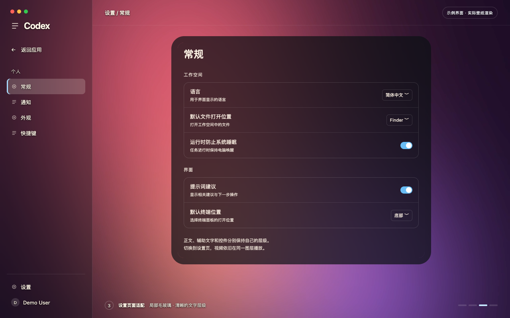

# 演示素材

[完整 MP4（21.6 秒）](https://github.com/TheRangerStar/codex-video-wallpaper/releases/download/v0.1.0/demo.mp4)




画面始终标注「示例界面 · 实际壁纸渲染」。它使用项目实际 `renderer.js` 和默认外观，运行在独立示例页面；不替代真实客户端的兼容性验收。

项目名、用户名、对话与文件名均为虚构。两段背景由原创数学渐变生成，未使用个人视频、照片或第三方素材，也未录制已登录客户端。

完整演示依次展示：整块侧栏玻璃、持续视频背景、两段视频的 600ms 过渡、进入设置、返回对话。

## 复现录像

开发依赖：Node.js 22+、FFmpeg、Google Chrome。它们不是用户使用壁纸时额外需要安装的工具。

在仓库根目录执行：

```sh
node demo/generate-backgrounds.mjs
node demo/record.mjs
```

可以用 `DEMO_CHROME` 环境变量指定其他 Chromium 可执行文件。脚本只启动自己的隔离浏览器；素材输出到 `demo/output/`。`--preview` 参数只输出预览截图。

生成的背景、临时浏览器目录、帧序列和验收状态均由 Git 忽略。源脚本及原创素材使用仓库的 MIT 许可证。
